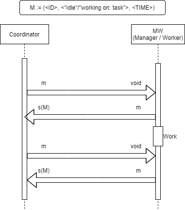
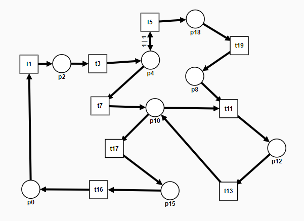
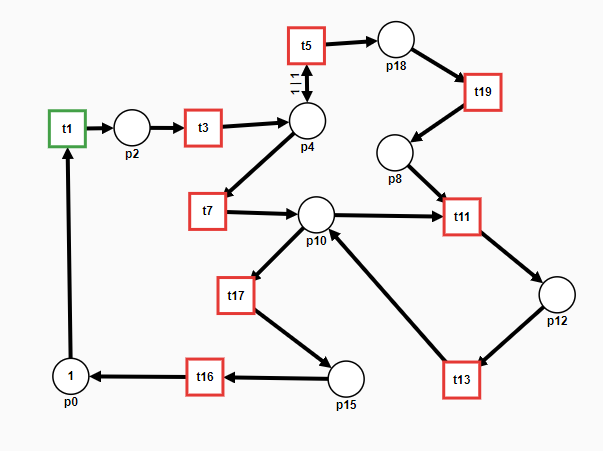
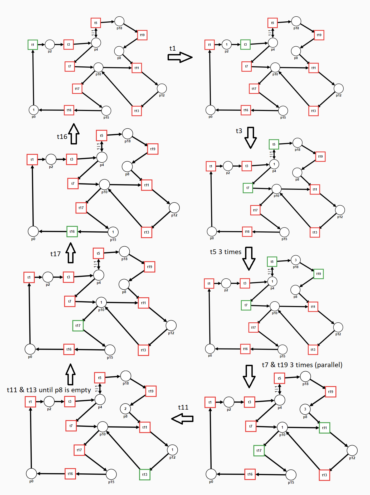
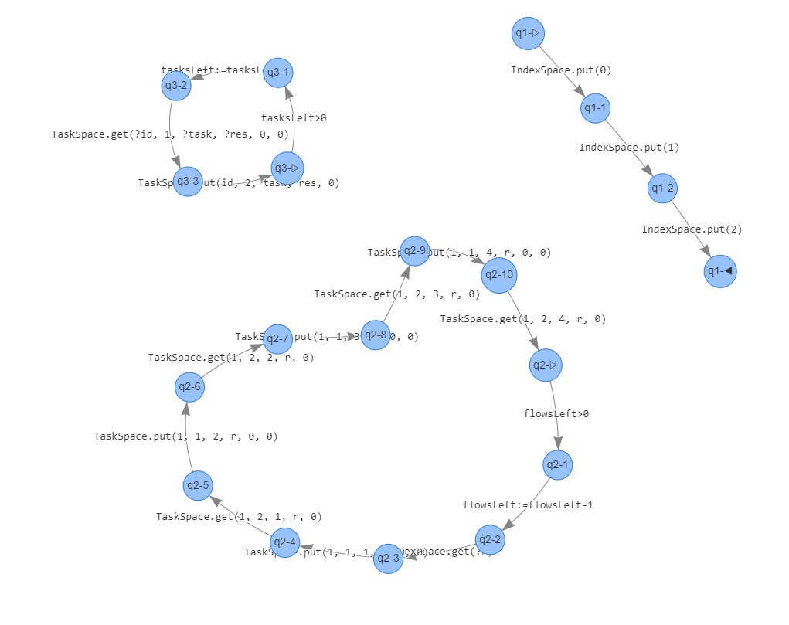

# 02148: Repository indexer

- Daniel F. Hauge <s201186@student.dtu.dk>
- Team: 24
- Jan. 22 - 2021

##### Abstract
Metis is the name of a bigger collection of systems that has been built mostly as a hobby. 
This project implements a system made to enable search features in other application in Metis, 
the resulting application is able to index and analyse files in selected repositories on services such as github. 
The application has been constructed with a goal of high scalability, achieved by an abundant amount of distribution and concurrency. 
Go with it's excellent concurrency features and "goSpaces" library has been utilized to provide the distribution and concurrency. 
The application works as follows.
The system can be thought of as 3 different applications, but is a single application which can be run in 3 different modes: Coordinator, Manager and Worker. 
The Coordinators purpose is to coordinate other applications by providing tuple spaces, status tracking, logging, interface for control and triggering work flows.
The Managers purpose is to manage work flows by delegating tasks to workers.
The Workers purpose is to receive and execute tasks, primarily index code files to a search optimized database (elasticsearch).


<div style="page-break-after: always; visibility: hidden"> \pagebreak </div>


# Content
- [02148: Repository indexer](#02148-repository-indexer)
        - [Abstract](#abstract)
- [Content](#content)
  - [1. Protocol](#1-protocol)
    - [1.1 Protocol: textual description](#11-protocol-textual-description)
    - [1.2 Protocol: graphical description](#12-protocol-graphical-description)
    - [1.3 Protocol: informal description](#13-protocol-informal-description)
    - [1.4 Protocol: implementation](#14-protocol-implementation)
  - [2. Petri Net](#2-petri-net)
    - [2.1 Petri Net: visual description](#21-petri-net-visual-description)
    - [2.2 Petri Net: informal description](#22-petri-net-informal-description)
    - [2.3 Petri Net: transition system](#23-petri-net-transition-system)
      - [Marking explanation](#marking-explanation)
      - [Transition system](#transition-system)
      - [Maximal paths & Infinite paths](#maximal-paths--infinite-paths)
    - [2.4 Petri Net: implementation](#24-petri-net-implementation)
      - [Manager](#manager)
      - [Worker](#worker)
  - [3. Concurrent Algorithm](#3-concurrent-algorithm)
    - [3.1 Concurrent Algorithm: code](#31-concurrent-algorithm-code)
    - [3.2 Concurrent Algorithm: tup4fun](#32-concurrent-algorithm-tup4fun)
    - [3.3 Concurrent Algorithm: testing](#33-concurrent-algorithm-testing)
    - [3.4 Concurrent Algorithm: transition system](#34-concurrent-algorithm-transition-system)
  - [4. Project Highlights](#4-project-highlights)
    - [4.1 Best actual feature](#41-best-actual-feature)
    - [4.2 Best potential feature](#42-best-potential-feature)
  - [5. Additional information](#5-additional-information)
    


<div style="page-break-after: always; visibility: hidden"> \pagebreak </div>

    
## 1. Protocol
I have chosen to showcase "Update-Status" protocol. The protocol is used by applications running in worker and manager mode, to enable status tracking feature. The protocol updates a tuple in a tuple space which holds all status messages for all the connected distributed applications. Each application will update its own status, and an interface on the coordinator will query/peak all statuses from the status space to be displayed.


### 1.1 Protocol: textual description
Disclaimer:
Worker and Manager initializes with: 

```MW.m -> Coordinator.StatusSpace(M)```

and close down with: 

```Coordinator.StatusSpace.m -> MV.v (tuple with id removed from space)```

Hence it can be assumed that a tuple with its ID is present in the coordinators status space for the lifetime of the worker/manager.


```
MW.m -> Coordinator.StatusSpace(M)
while alive?@MW do
    Coordinator.StatusSpace.m -> MV.v
    MW.m -> Coordinator.StatusSpace(M)
    // Work being done by worker/manager
    Coordinator.StatusSpace.m -> MV.v
    MW.m -> Coordinator.StatusSpace(M)
Coordinator.StatusSpace.m -> MV.v
```

<div style="page-break-after: always; visibility: hidden"> \pagebreak </div>

### 1.2 Protocol: graphical description
The image below illustrates the graphical representation of the protocol. This illustration does not take initalization and deinitialization code into consideration.



```
Coordinator -> MW;
MW -> Coordinator;
Coordinator -> MW;
MW -> Coordinator
```


### 1.3 Protocol: informal description
- When a worker or manager initializes it puts its initial status tuple into status space with its id and idle.
- A worker and manager will keep updating its status as long as it lives.
- When a task is taken, the worker or manager will remove its previous status from status space.
- Immedietly after removing status from status space, the worker or manager will put new status with the task taken into status space.
- When task is done, status is removed from status space
- Immedietly after status is removed, a new idle status is put into status space.
- When worker or manager closes down, it removes its status from status space.

<div style="page-break-after: always; visibility: hidden"> \pagebreak </div>

### 1.4 Protocol: implementation
The coordinator is only providing the space, all the implementation of this protocol is done on worker or manager. This is not the full actual code, it can be found in shared/status.go in the repository.

```
Coordinator Init:
    StatusSpace = space.NewSpace(uri)

Worker/Manager Init:
    StatusSpace = space.NewRemoteSpace(uri)
    StatusSpace.Put(StatusId, "idle", time.Now().Format(TimeFormat))

Worker/Manager:
    StatusSpace.Get(StatusId, &s, &t)
    StatusSpace.Put(StatusId, "Working on: %v", time.Now().Format(TimeFormat))
    // Working
    StatusSpace.Get(StatusId, &s, &t)
    StatusSpace.Put(StatusId, "idle, last task: %v", time.Now().Format(TimeFormat))

Worker/Manager Close:
    StatusSpace.GetP(StatusId, &s, &t)

```

<div style="page-break-after: always; visibility: hidden"> \pagebreak </div>


## 2. Petri Net
The index work flow is chosen. The index work flow is triggered by the coordinator and picked up a manager, which delegates tasks to workers.

### 2.1 Petri Net: visual description


 
 
### 2.2 Petri Net: informal description
The diagram illustrates the work flow of a repository getting indexed.

**pX**: Places / Points for control such as syncronization or conditionals.

**tX**: Transitions, such as tasks executed.

- p0 : Waiting for index task, this is the initial control point. Coordinator starts work flow by putting a token into p0.
- t1 : Manager receives the repository to be indexed with token given by coordinator. 'IndexSpace.Get()', Manager updates status and delegate task to clear previusly indexed code files from repository.
- p2 : Waiting for Clear Task to be finished.
- t3 : Receiving confirmation of Clear repository task, proceeds to clone repository.
- p4 : This point the manager has access to files in the repository. Either there is no more files which means transition with t7, otherwise iterate to next code file and transition with t5.
- t5 : Task for code file to be indexed and analysed is delegated. Also a task counter is incremented.
- t7 : No more files, (stop foreach loop).
- p18 : Index tasks space. (Tokens here equates to pending index or analyse tasks)
- t19 : Index task execution
- p8 : Index-Tasks results space. (Tokens here equates to index or analyse task results)
- p10 : If there are no more results to be received then transition with t17, otherwise transition with t11.
- t11 : Receive index task result (This transition requires the manager is ready to receive the result and a worker has completed the task and put the results in the tuple space)
- p12 : If task counter is 0 then transition with t13 otherwise transition with t11
- t13 : Aggregate results and delegate "index analysis-report" task
- p15 : Wait for "index analysis-report" task
- t16 : Cleanup and update status. This transition will return to the initial state.
  - Depending on semantics, this transition would either put a token in p0 but could also not put a token in p0. The system is built to reindex the repository after a set amount of time, which is implemented like a cron job. Conceptually, t16 would be this cron job, in such a case the transition would put a token at p0 when cron job triggers. On the other hand, the coordinator is the instigator and will put a token on p0 on cron trigger, for the given repository regardless of status of the current indexing work flow, hence it could be argued that t16 should not have outgoing place p0, but just consume the token. It depends on the scope, ie. at which perspective to look at the system. I've chosen to include the coordinator in the scope of the petri net, such that when adding a repository to the system, it illustrates correctly that it keeps running forever by reindexing every 24 hours as intended.

<div style="page-break-after: always; visibility: hidden"> \pagebreak </div>

### 2.3 Petri Net: transition system
#### Marking explanation
The marking illustrated below is the state at which the work flow starts. The work flow is triggered by a coordinator.
There are no tokens other than one in p0 in the initial marking, however more tokens will be generated by the split transition at t5, and joined at transition t11. These splits and joins are the index file jobs being delegated and results aggregated. When the work flow is complete it will reach the initial marking again, indicating it's readyness to take on a new repository to index.




<div style="page-break-after: always; visibility: hidden"> \pagebreak </div>

#### Transition system
N.B. Work flow will transition through t5 as many times as there are files to be indexed and analysed. In this example, it is 3 times.



#### Maximal paths & Infinite paths
The possible paths is dynamic in length depending on how many times transition t5 is used, this means there are infinitly many paths. Having infinitly many paths is a very good thing, as the system is then able to handle repositories regardless of many files there might be.
There are no transition nor place without a corresponding outgoing place or transition, this will guarantee the petri net will allways make progress without getting stuck. 
The petri net will allways advance to the next state, until the initial state has been reached once again, this is a good thing as it can keep the system alive and working. 


### 2.4 Petri Net: implementation
These snippets provide insight into how the petri net is implemented. The implementation approach is ad-hoc, where the petri net is derived from a working code implementation. N.B. The code snippets have been heavily edited and commented to exclude some imperative code, thus only showcase code relevant for implementing the petri net. "..." indicate code has been cut out.

#### Manager
```go
for {
        ...
        IndexSpace.Get(&r) // -> p0
		TaskSpace.Put(ClientName, TASK, CLEAR, r, "none", "none") // p0 -> t1
		TaskSpace.Get(ClientName, RESULT, CLEAR, r, &res) // t3 -> p4
        ...
		tasksCount := 0
		files.ForEach(func(file *object.File) error {
                ... // p4 -> t5
                TaskSpace.Put(ClientName, TASK, INDEX_FILE, r, n, content )
                ...
			}
			return nil 
		}) // p4 -> t7

		for tasksCount > 0 {
            ...
			TaskSpace.Get(ClientName, RESULT, &taskName, r, &res) // p10 -> t11
            tasksCount--
            ... // t13 (aggregate goReports cut out to save space)
		} // when taskCount == 0 => p10 -> t17

        ...
		TaskSpace.Put(ClientName, TASK, INDEX_REPORT, r, "report.analysis", goReports.RenderJSON()) // p10 -> t17
		TaskSpace.Get(ClientName, RESULT, INDEX_REPORT, r, &res) // p15 -> t16
        ...
	}
```

<div style="page-break-after: always; visibility: hidden"> \pagebreak </div>

#### Worker
```go
for {
    if _, e := TaskSpace.Get(&managerId, TASK, &task, &repository, &fileName, &fileContent); CheckError(e) { continue }
    ...
    switch task {
    case INDEX_FILE:
        go IndexCodeFile(repository, fileName, fileContent) // t19
        _,e := TaskSpace.Put(managerId, RESULT, task, repository, "indexed") //p8
        CheckError(e)
    case ANALYSE_GO:
        report := AnalyseGoFile(fileName, fileContent) // t19
        _,e := TaskSpace.Put(managerId, RESULT, task, repository, report.RenderJSON()) //p8
        CheckError(e)
    case INDEX_REPORT:
        IndexReport(repository, ParseReports(fileContent)) // t17
        _,e := TaskSpace.Put(managerId, RESULT, task, repository, "indexed")//p15
        CheckError(e)
    case CLEAR:
        go ClearRepositoryFromIndex(repository) // t3
        _,e := TaskSpace.Put(managerId, RESULT, task, repository, "cleared") // p4
        CheckError(e)
    ...
    }
    ...
}
```


<div style="page-break-after: always; visibility: hidden"> \pagebreak </div>


## 3. Concurrent Algorithm
The index work flow algorithm will be used as the concurrent algorithm, which this section will adress. The index work flow is addressed in the petri net section aswell.

### 3.1 Concurrent Algorithm: code
The code snippets can be found in section 2.4 Petri Net: implementation. 

The actual implementation are found in files on the github repository: worker/worker.go and manager/initialization.go.

### 3.2 Concurrent Algorithm: tup4fun
Because of the limitations and lack of string support in tup4fun, the model has gotten significant changes to the actual implementation. 
As for the tup4fun model, the fields: content, filename and result is irrelevant, as they do not contribute to coordination logic, they have been substituted with 0. 
The actual values of repository is also irrelevant, however they must stay unqique and consistent with the business logic. 
Repository has been substituted with an integer 0, 1 or 2 to indicate different index work flows. 
Manager Id, Type and Task have been substituted with unique integers.


TaskSpace tuples:
| Manager Id | Type | Task | Repository | Filename / Result | Content |
| --- | --- | --- | --- | --- | --- |
| 1/2 | 1 (TASK) / 2 (RESULT) | 1 (CLEAR) / 2 (Index File) / 3 (Analyse file) / 4 (Index analysis) | 0, 1, 2 | 0 | 0 |

<div style="page-break-after: always; visibility: hidden"> \pagebreak </div>

The model tries to be as faithfull to the original implementation and test execution, trying to simulate ressources: 2 managers and 5 workers competing to consume tokens. N.B. worker and manager only appear once for readability.

Initialization ```IndexSpace = (R, INF, {}), TaskSpace = (R,INF, {}), r=0, res=0, id=0, task=0```

```
par // Simulated coordinator
   loop true -> 
        IndexSpace.put(0);
        IndexSpace.put(1);
        IndexSpace.put(2)
    pool
[] // Simulated Manager x 2
   loop true -> IndexSpace.get(?r);
                // Clear task
                TaskSpace.put(1, 1, 1, r, 0, 0);
                TaskSpace.get(1, 2, 1, r, 0);

                // Index file and receive result
                TaskSpace.put(1, 1, 2, r, 0, 0);
                TaskSpace.get(1, 2, 2, r, 0);

                // Analyse file and recieve result
                TaskSpace.put(1, 1, 3, r, 0, 0);
                TaskSpace.get(1, 2, 3, r, 0);

                // Index report and receive confirmation
                TaskSpace.put(1, 1, 4, r, 0, 0);
                TaskSpace.get(1, 2, 4, r, 0)
   pool
[] // Simulated Worker x 5
   loop true -> TaskSpace.get(?id, 1, ?task, ?r, 0, 0);
                // Do task and report result.
                TaskSpace.put(id, 2, task, r, 0)
   pool
rap

```

<div style="page-break-after: always; visibility: hidden"> \pagebreak </div>

### 3.3 Concurrent Algorithm: testing
Testing with the tup4fun model from previous section, reveals the absence of deadlocks and the presence of the desired infinite behavior. Testing also revealed a potentially undesired behavior. If the instigator (ie. Coordinator) is not kept in check with triggering index work flows, like with this model, the IndexSpace will grow infinitely. The IndexSpace will not grow infinitely in the actual implementation as it is kept in check by a cron job.

Although the model is more faithful to the actual implementation, I've also tested with a significantly simplified model that is still very close to the original behavior. I've tested with the smaller example as it is easier to parse the smaller details. This a slim finite version that only has a single manager and worker which does work flows for 3 different repositories only once.

Initialization: ```IndexSpace = (R, INF, {}), TaskSpace = (R,INF, {}), r=0, res=0, id=0, task=0, flowsLeft=3, tasksLeft=12```
```
par 
   IndexSpace.put(0);
   IndexSpace.put(1);
   IndexSpace.put(2)
[]
   loop flowsLeft > 0 -> flowsLeft := flowsLeft - 1;
                IndexSpace.get(?r);
                TaskSpace.put(1, 1, 1, r, 0, 0);
                TaskSpace.get(1, 2, 1, r, 0);
                TaskSpace.put(1, 1, 2, r, 0, 0);
                TaskSpace.get(1, 2, 2, r, 0);
                TaskSpace.put(1, 1, 3, r, 0, 0);
                TaskSpace.get(1, 2, 3, r, 0);
                TaskSpace.put(1, 1, 4, r, 0, 0);
                TaskSpace.get(1, 2, 4, r, 0)
   pool
[]
   loop tasksLeft > 0 -> tasksLeft := tasksLeft -1;
                TaskSpace.get(?id, 1, ?task, ?res, 0, 0);
                TaskSpace.put(id, 2, task, res, 0)
   pool
rap
```
Besides a potential infinite IndexSpace growth, testing with both models confirms the desired behavior.

<div style="page-break-after: always; visibility: hidden"> \pagebreak </div>


### 3.4 Concurrent Algorithm: transition system
To provide a reasonable portion of the transition system, only the simplified tup4fun model's program graph is illustrated. The transition system is derived from that. The graph is based on a coordinator initating 3 index work flows, a manager that controls the 3 work flow and a worker that receives and execute the 14 tasks. The worker, coordinator and manager is not connected in this graph, meaning each can transition to their next state independent of the other applications. Although each application can transition independently, the worker and managers contain blocking operations to sync up (.Get). In this case there are too many combinations of state transitions possible even from the start that i was able to fit in one page.

The coordinator is ullustrated by the 4 states which does the following: put 0, 1, 2 into IndexSpace and then stops.
The worker is illustrated by the 4 states looping doing the following: Gets task from TaskSpace, do task, decrement taskcounter, return result.
The manager is illustrated by the 11 states doing the following: Gets repository from IndexSpace, delegates a task and gets results 4 times, and decrementing flowsLeft.




<div style="page-break-after: always; visibility: hidden"> \pagebreak </div>

## 4. Project Highlights

### 4.1 Best actual feature
In my opinion, one of the best features is the systems scalability. Scalablility in other word, to have knobs that can be turned in order to increase or decrease throughput. The system is built and run within lightweight virtualized environments, namely docker containers. Building the system with the level of independency within docker containers enables excellent scaling. It does not matter which worker does the work, nor which manager manages a flow. With the level of independency, the amount of workers and managers can be tuned to the need of the system. If the bottleneck is indexing or analysing code files, the amount of workers can be increased to meet throughput expectations. If the amount of index work flows are piling up, the amount of managers can also be increased to meet concurrency expectations. Scalability is a metric I believe is becomming increasingly important within software, which is why i think scalability is a nice feature. 

To highlight how scalable the system is, the following examples can be executed in a terminal to scale the system. (It requires a docker network connection where a coordinator and elasticsearch container is also running).
```
// Spin up additional applications. (env mode can be changed to mananger or coordinator)
docker run 
    -dit --network showcase-indexer
    -e host=server 
    -e ELASTICSEARCH_URL="http://elasticsearch:9200" 
    -e mode=worker
    metis-showcase-indexer

// Or scaling when running in docker swarm cluster (Clusters of computers). 
// Example: this scales to 6 worker applications. (requires docker service setup)
docker service scale workers=6
```
Although docker is the tool used to scale the system, it is important to note that it's the coordination logic that enables the scaling.

<div style="page-break-after: always; visibility: hidden"> \pagebreak </div>

### 4.2 Best potential feature
The coordination is exclusively done through a single coordinator application, which could introduce bottlenecks as each application will produce trafic through a single point (The coordinator).
Although the trafic generated might be small, it could become an issue for usages with very high throughput requirements, that require an extra ordinary amount of workers and managers. If mentioned issue becomes a problem, it is hindering scalability which is a bad thing.

An idea for a simple potential solution to the problem could be having localized and dedicated workers for each manager. Dedicated workers for managers would go well with some kind of auto scaling feature, which could control the amount of workers running based on throughput specifications given. The proposed solution might solve the problem, but at a cost of introducing high complexity to the system.

A more advanced potential solution to the weakness, could be to introduce some kind of worker delegation logic, in such a way that workers gets assigned to manangers. When workers gets assigned a manager, it could establish a direct connection so further traffic would not go through the coordinator. Limiting the trafic through the coordinator could defend the weakness.

<div style="page-break-after: always; visibility: hidden"> \pagebreak </div>

## 5. Additional information
This project resides in a repository on github. It can be found at the following link: https://github.com/DanielHauge/metis-showcase-indexer

A video has been made to demonstrate the systems execution and features. 
The video can be found on youtube at the following link: https://youtu.be/sn13RQSzkVI
